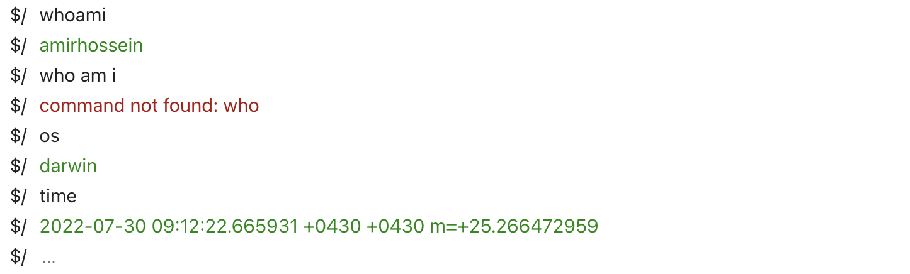

# Terminal


Creating a bash terminal with **Golang** and **Vue.js**.

## How to use the project?
Clone into project:
```shell
git clone https://github.com/amirhnajafiz/terminal.git
```

Start back-end server:
```shell
cd server
go run main.go
```

Server will be starting on **5000**.

Start client application:
```shell
cd client
npm run dev
```

Application will be available on **5173**.

### Demo


### Backend testing
```
curl -X POST -H "Content-Type: application/json" -d '{"command": "time"}' http://localhost:5000/api/cmd

curl -X POST -H "Content-Type: application/json" -d '{"command": "whoami"}' http://localhost:5000/api/cmd

curl -X POST -H "Content-Type: application/json" -d '{"command": "os"}' http://localhost:5000/api/cmd
```
